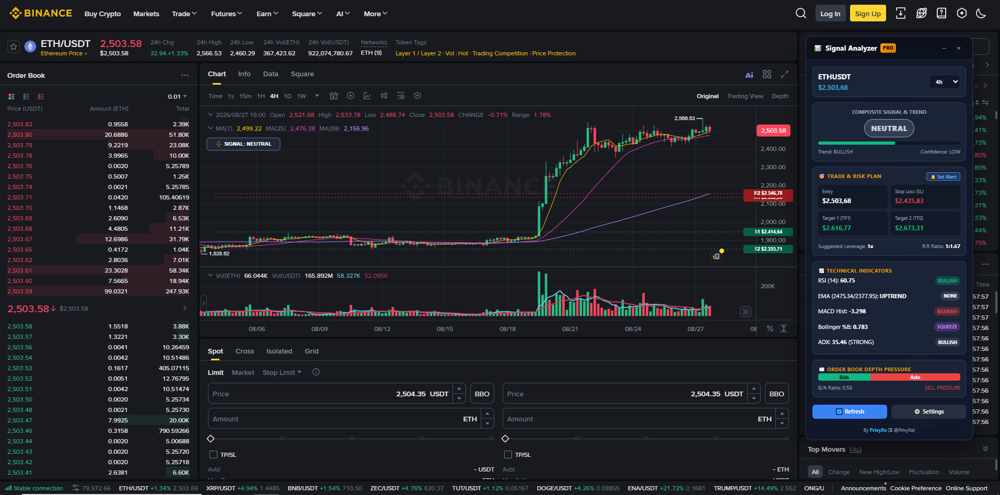

<div align="center">

# 📊 Binance Signal Analyzer Pro

### Advanced Technical Analysis, Market Screener & TP/SL Alerts for Binance Trading

[](https://github.com/PrivyXe/Binance-Signal-Analyzer)
[](https://developer.chrome.com/docs/extensions/mv3/intro/)
[](https://x.com/PrivyXe)
[](https://github.com/PrivyXe)
[](LICENSE)

**Developed by [@PrivyXe](https://x.com/PrivyXe)**

---

</div>

<a name="english"></a>

## 🚀 Overview

A powerful Chrome Extension (Manifest V3) that provides real-time technical analysis for Binance trading. Analyzes market data using 10+ technical indicators and displays buy/sell signals directly on TradingView charts with a beautiful, non-intrusive overlay.

### ✨ Key Features

#### 📊 Advanced Technical Analysis
- 📈 **10 Technical Indicators** - RSI, EMA, SMA, MACD, Bollinger Bands, Stochastic, ADX, ATR, Parabolic SAR, Volume SMA
- 📍 **Support & Resistance Detection** - Automatic swing high/low algorithm with strength indicators
- 📊 **Volume Profile** - POC (Point of Control), VAH/VAL (Value Area High/Low) analysis
- 📐 **Fibonacci Retracement & Extension** - Automatic 0%, 23.6%, 38.2%, 50%, 61.8%, 78.6%, 100% levels + extensions
- 📖 **OrderBook Analysis** - 100-level deep order book with buy/sell pressure indicators

#### 🎯 Smart Trading Recommendations
- 💰 **TP/SL Calculator** - ATR-based Take Profit and Stop Loss levels
- 📊 **Leverage Recommendations** - Smart 2x-5x leverage suggestions based on signal strength
- ⚖️ **Risk/Reward Ratio** - Automatic R:R calculation for every trade
- 🎯 **Confidence Levels** - HIGH/MEDIUM/LOW confidence based on order book confirmation
- 🔴 **Aggressive Bearish Signals** - SELL/SHORT recommendations in bearish trends

#### 🎨 Visualization & UI
- 🎨 **Visual Chart Overlay** - Beautiful canvas-based drawing on Binance charts
- 📏 **Live Support/Resistance Lines** - Color-coded levels with strength indicators (R1, R2, S1, S2)
- 📊 **Volume Profile Histogram** - Side panel showing high-volume price levels
- 🎯 **TP/SL Lines on Chart** - Visual green (TP) and red (SL) lines
- 📱 **Enhanced Floating Panel** - Draggable, minimizable panel with comprehensive metrics

#### ⚡ Performance & Customization
- ⚡ **Real-time Updates** - Updates every 5 seconds with live market data
- ⚙️ **Fully Customizable** - Configure every indicator parameter via advanced settings
- 🔄 **Dynamic Timeframes** - Seamlessly switch between 1m to 1w timeframes
- 🌓 **Modern Dark UI** - Glassmorphism design with smooth animations
- 🔐 **Secure & Private** - All data stored locally, no external servers
- 🚫 **Non-intrusive** - Doesn't modify Binance or TradingView functionality

## 📸 Screenshots & Live Preview

<div align="center">
  
  <p><em>Real-Time Binance TradingView Chart Overlay with Live Support/Resistance Levels, TP/SL Target Lines & Indicator Signals</em></p>
</div>

---

## 🛠️ Installation & Development

### 📦 Build & Run (TypeScript + Manifest V3)

1. **Clone the repository**
   ```bash
   git clone https://github.com/PrivyXe/binance-signal-analyzer.git
   cd binance-signal-analyzer
   ```

2. **Install dependencies**
   ```bash
   npm install
   ```

3. **Build the extension**
   ```bash
   npm run build
   ```
   > This compiles all TypeScript sources and creates the production-ready extension in the `dist/` directory.

4. **Load into Google Chrome**
   - Open Chrome and navigate to `chrome://extensions/`
   - Toggle **Developer mode** (in the top-right corner)
   - Click **Load unpacked**
   - Select the `dist/` directory inside this project folder

5. **Development Watch Mode**
   ```bash
   npm run dev
   ```

### 📁 Project Architecture

```text
├── dist/                # Production-ready Chrome Extension build
├── public/              # Static assets & Manifest V3 configuration
│   ├── icons/           # Extension icons (16, 48, 128px)
│   └── manifest.json    # Chrome Extension Manifest V3 definition
├── src/
│   ├── types/           # Strongly-typed models (Binance, Indicators, Signals, Settings)
│   ├── indicators/      # Pure mathematical technical indicators (RSI, EMA, MACD, BB, etc.)
│   ├── services/        # API client, Storage service & Multi-indicator Signal Engine
│   ├── background/      # MV3 Service Worker & background scheduler
│   ├── content/         # Binance & TradingView chart detector, Canvas overlay & Floating HUD
│   ├── popup/           # Quick status popup (HTML/TS/CSS)
│   ├── options/         # Comprehensive settings dashboard (HTML/TS/CSS)
│   └── styles/          # Modern Glassmorphism theme and stylesheets
├── package.json
├── tsconfig.json
└── vite.config.ts
```

### Understanding Signals & Recommendations

| Signal | Meaning | Visual | Leverage |
|--------|---------|--------|----------|
| 🟢 **LONG** | Strong bullish signal - Enter long position | Green arrow up + TP/SL lines | 2-5x |
| 🔴 **SHORT** | Strong bearish signal - Enter short position | Red arrow down + TP/SL lines | 2-5x |
| 🔴 **SELL** | Spot sell recommendation - Exit positions | Red indicator | 1x (Spot) |
| ⚪ **HOLD** | No clear signal - Wait for better opportunity | Trend indicator only | - |

### Trading Recommendations Explained

Every signal includes comprehensive trading recommendations:

- **Action**: LONG, SHORT, SELL, or HOLD
- **Take Profit (TP)**: Target price based on 2.5× ATR
- **Stop Loss (SL)**: Risk level based on 1.5× ATR
- **Leverage**: Recommended 2x-5x based on signal strength and RSI
- **Risk/Reward Ratio**: Calculated profit vs loss ratio (e.g., 1:2.5)
- **Confidence**: HIGH/MEDIUM/LOW based on order book pressure confirmation

### Panel Information Display

The floating panel shows comprehensive trading data:

#### Market Overview
- **Symbol & Timeframe** - Current trading pair and interval
- **Current Price** - Real-time price display
- **Trend** - BULLISH 🟢 / BEARISH 🔴 / NEUTRAL ⚪

#### Active Indicators
- **RSI** - With oversold/overbought highlighting
- **EMA20 / EMA50** - Moving averages
- **MACD** - Momentum indicator
- All other enabled indicators

#### Trading Recommendations
- **Action** - LONG/SHORT/SELL/HOLD
- **Take Profit** - Target price
- **Stop Loss** - Risk level
- **Leverage** - Recommended 2x-5x
- **R/R Ratio** - Risk vs Reward (e.g., 1:2.5)
- **Confidence** - HIGH/MEDIUM/LOW

#### Key Levels
- **Resistance** - Nearest resistance level
- **Support** - Nearest support level

#### Volume Profile
- **POC** - Point of Control price
- **VAH** - Value Area High
- **VAL** - Value Area Low

#### Fibonacci
- **38.2%** - First retracement level
- **50%** - Mid-level (psychological)
- **61.8%** - Golden ratio (strongest)
- **Trend** - Uptrend/Downtrend indicator

#### Order Book
- **Bid/Ask Ratio** - Market balance
- **Pressure** - 🟢 BUY / 🔴 SELL / ⚪ NEUTRAL
- **Spread** - Current spread in $ and %

### Panel Controls

- **🔄 Refresh** - Force update analysis immediately
- **⚙️ Settings** - Open advanced settings page
- **− Minimize** - Hide/show panel content
- **× Close** - Hide panel (refresh page to show again)
- **Drag** - Click header to move panel anywhere

## 📊 Technical Indicators

### Supported Indicators (10 Total)

| Indicator | Default Parameters | Purpose |
|-----------|-------------------|---------|
| **RSI** | Period: 14, Oversold: 30, Overbought: 70 | Momentum & overbought/oversold |
| **EMA** | Fast: 20, Slow: 50 | Trend direction & crossovers |
| **SMA** | Fast: 20, Slow: 50 | Alternative trend indicator |
| **MACD** | Fast: 12, Slow: 26, Signal: 9 | Momentum & trend strength |
| **Bollinger Bands** | Period: 20, StdDev: 2 | Volatility & price extremes |
| **Stochastic** | K: 14, D: 3 | Momentum oscillator |
| **ADX** | Period: 14 | Trend strength measurement |
| **ATR** | Period: 14 | Volatility for stop-loss |
| **Parabolic SAR** | Step: 0.02, Max: 0.2 | Trend reversal points |
| **Volume SMA** | Period: 20 | Volume trend analysis |

### Advanced Signal Strategy

#### 🟢 LONG Signals (Bullish)
| RSI Level | Action | Leverage | Confidence |
|-----------|--------|----------|------------|
| RSI < 30 | LONG | 5x | Strong signal |
| RSI < 35 | LONG | 4x | Good signal |
| RSI < 45 | LONG | 3x | Moderate signal |

**Additional Confirmations:**
- EMA20 > EMA50 (bullish trend)
- Order book shows BUY_PRESSURE (ratio > 1.15)
- Price near support levels
- Volume increasing

#### 🔴 SHORT Signals (Bearish)
| RSI Level | Action | Leverage | Confidence |
|-----------|--------|----------|------------|
| RSI > 70 | SHORT | 5x | Strong signal |
| RSI > 65 | SHORT | 4x | Good signal |
| RSI > 55 | SHORT | 3x | Moderate signal |
| RSI 45-55 | SHORT | 2x | Conservative |
| RSI < 45 | SELL (Spot) | 1x | Exit positions |

**Additional Confirmations:**
- EMA20 < EMA50 (bearish trend)
- Order book shows SELL_PRESSURE (ratio < 0.85)
- Price near resistance levels
- Divergences detected

#### 📊 Order Book Analysis
- **100 Levels Deep**: Analyzes 100 bid/ask levels for comprehensive market depth
- **Volume + Value**: Uses both quantity and USD value for accurate pressure
- **Pressure Thresholds**: 
  - Ratio > 1.15 → BUY_PRESSURE 🟢
  - Ratio < 0.85 → SELL_PRESSURE 🔴
  - 0.85-1.15 → NEUTRAL ⚪

#### 📍 Support & Resistance
- **Swing Algorithm**: Finds swing highs/lows with 10-candle lookback
- **Clustering**: Groups levels within 0.5% tolerance
- **Strength Indicators**: Shows how many times level was tested
- **Visual Display**: Color-coded lines (Red = Resistance, Green = Support)

#### 📊 Volume Profile
- **POC (Point of Control)**: Highest volume price level - strongest S/R
- **VAH (Value Area High)**: Upper boundary of 70% volume
- **VAL (Value Area Low)**: Lower boundary of 70% volume
- **Histogram**: Shows volume distribution across price levels

#### 📐 Fibonacci Levels
- **Retracement**: 0%, 23.6%, 38.2%, 50%, 61.8%, 78.6%, 100%
- **Extension**: 127.2%, 161.8%, 200%, 261.8%
- **Auto Detection**: Finds swing high/low automatically
- **Visual Display**: Color-coded levels on chart (Golden ratio: 61.8%)
- **Trend Recognition**: Shows if market is in uptrend or downtrend

## ⚙️ Configuration

### Quick Settings (Popup)

Click extension icon in toolbar:
- Change symbol (BTCUSDT, ETHUSDT, etc.)
- Select timeframe (1m - 1w)
- Toggle common indicators
- Quick save & apply

### Advanced Settings

Click ⚙️ button in panel or right-click extension → Options:

- **API Configuration** - Optional Binance API keys
- **Indicator Parameters** - Fine-tune every indicator
- **Trading Config** - Symbol, interval, update frequency
- **Custom Strategy** - Modify signal generation logic

### Example Configurations

#### Scalping (1m - 5m)
```javascript
Timeframe: 1m or 3m
Indicators: RSI, EMA, Stochastic
RSI: 25/75 (more sensitive)
EMA: 9/21 (faster)
Update: 5 seconds
```

#### Day Trading (15m - 1h)
```javascript
Timeframe: 15m
Indicators: RSI, EMA, MACD, BB
Default parameters
Update: 10 seconds
```

#### Swing Trading (4h - 1d)
```javascript
Timeframe: 4h or 1d
Indicators: SMA, MACD, ADX, ATR
SMA: 50/200 (long-term)
Update: 30 seconds
```

## 📁 Project Structure

```
extension/
├── manifest.json           # Extension configuration (Manifest V3)
├── background.js          # Service worker - Core engine
│   ├── Kline data fetching (Binance API)
│   ├── OrderBook analysis (100 levels)
│   ├── Technical indicator calculations
│   ├── Support/Resistance detection
│   ├── Volume Profile calculation
│   ├── TP/SL recommendations
│   └── Signal generation logic
├── content.js            # Content script - UI management
│   ├── Floating panel creation
│   ├── Real-time data display
│   ├── Indicator formatting
│   └── User interaction handling
├── overlay.js            # Chart overlay - Visual drawing
│   ├── Fibonacci retracement/extension
│   ├── Support/Resistance lines
│   ├── Volume Profile histogram
│   ├── TP/SL level indicators
│   ├── Signal arrows
│   └── Trend indicators
├── indicators.js         # Pure calculation functions
│   ├── RSI, EMA, SMA, MACD
│   ├── Bollinger Bands, Stochastic
│   ├── ADX, ATR, Parabolic SAR
│   └── Volume analysis
├── popup.html/js         # Quick settings popup
├── options.html/js       # Advanced settings page
├── styles.css           # Modern UI styling
│   ├── Panel design
│   ├── Color schemes
│   └── Animations
└── icons/               # Extension icons
```

## 🔧 Development

### Prerequisites

- Chrome 88+ or any Chromium-based browser
- Basic understanding of Chrome Extensions
- JavaScript ES6+ knowledge

### Local Development

```bash
# Clone repository
git clone https://github.com/PrivyXe/binance-signal-analyzer.git

# Make changes to extension files
cd extension

# Reload extension in chrome://extensions/
# Test on Binance trading page
```

### Adding New Indicators

1. Add calculation function to `indicators.js`
2. Add UI controls to `options.html`
3. Update settings schema in `options.js`
4. Add calculation call in `background.js`
5. Update panel display in `content.js`

## 🎨 Customization

### UI Themes

Modify `styles.css` to change colors, layout, or animations:

```css
/* Change panel colors */
.signal-panel {
  background: linear-gradient(135deg, your-color-1, your-color-2);
}

/* Modify signal colors */
.signal-buy { color: #00ff88; }
.signal-sell { color: #ff4444; }
```

### Strategy Logic

Edit `background.js` → `analyzeMarket()` function:

```javascript
// Custom BUY signal
if (rsi < 35 && ema20 > ema50 && indicators.bb.lower > currentPrice) {
  signal = 'BUY';
}
```

## 📈 Performance

- **CPU Usage**: <1% average
- **Memory**: 10-25MB (depends on active indicators)
- **Network**: ~5-10KB per update
- **Battery Impact**: Minimal

## 🌐 Browser Compatibility

| Browser | Minimum Version | Status |
|---------|----------------|--------|
| Chrome | 88+ | ✅ Fully Supported |
| Edge | 88+ | ✅ Fully Supported |
| Brave | 1.20+ | ✅ Fully Supported |
| Opera | 74+ | ✅ Fully Supported |
| Firefox | ❌ | Not Supported (Manifest V3 differences) |

## 🤝 Contributing

Contributions are welcome! Please follow these steps:

1. Fork the repository
2. Create feature branch (`git checkout -b feature/AmazingFeature`)
3. Commit changes (`git commit -m 'Add some AmazingFeature'`)
4. Push to branch (`git push origin feature/AmazingFeature`)
5. Open Pull Request

### Contribution Ideas

- [ ] Add more technical indicators (Ichimoku, etc.)
- [ ] Multiple symbol tracking dashboard
- [ ] Alert/notification system with sound
- [ ] Signal history & backtesting engine
- [ ] Export data to CSV/JSON
- [ ] Mobile app integration
- [ ] Visual strategy builder
- [ ] Dark/light theme toggle
- [ ] Heatmap visualization
- [ ] Order flow analysis
- [ ] Market profile charts
- [ ] Time & Sales data

## 📋 Roadmap

### Version 1.0 ✅ (Current)
- ✅ 10 Technical indicators
- ✅ Support/Resistance detection
- ✅ Volume Profile analysis
- ✅ OrderBook integration (100 levels)
- ✅ Fibonacci retracement/extension
- ✅ TP/SL calculator
- ✅ Leverage recommendations
- ✅ Visual chart overlay
- ✅ Risk/Reward ratio

## ⚠️ Disclaimer

**IMPORTANT LEGAL NOTICE:**

This extension is provided for **EDUCATIONAL and INFORMATIONAL purposes ONLY**. It is NOT financial advice, investment advice, trading advice, or any other sort of advice.

- ❌ This is NOT a guarantee of profits
- ❌ Past performance does NOT indicate future results
- ❌ Crypto trading involves SIGNIFICANT RISK
- ❌ You may lose ALL invested capital

**Always:**
- ✅ Do your own research (DYOR)
- ✅ Never invest more than you can afford to lose
- ✅ Use proper risk management
- ✅ Consult with licensed financial advisors
- ✅ Trade responsibly

The developers assume NO responsibility for any financial losses incurred through the use of this extension.

## 📄 License

MIT License - Copyright (c) 2024

Permission is hereby granted, free of charge, to any person obtaining a copy of this software and associated documentation files (the "Software"), to deal in the Software without restriction, including without limitation the rights to use, copy, modify, merge, publish, distribute, sublicense, and/or sell copies of the Software.

See [LICENSE](LICENSE) file for full text.

## 💬 Support

- 🐛 **Bug Reports**: [Open an issue](https://github.com/PrivyXe/binance-signal-analyzer/issues)
- 💡 **Feature Requests**: [Request a feature](https://github.com/PrivyXe/binance-signal-analyzer/issues)
- 💬 **Discussions**: [GitHub Discussions](https://github.com/PrivyXe/binance-signal-analyzer/discussions)

## 🙏 Acknowledgments

- [Binance API](https://binance-docs.github.io/apidocs/) - Market data provider
- [TradingView](https://www.tradingview.com/) - Chart platform
- Chrome Extension Documentation
- Open source community

---

<div align="center">

### ⭐ Star this repo if you find it helpful!

Made by [x.com/PrivyXe](https://x.com/PrivyXe)

**Happy Trading! 📈🚀**

*(But remember: Trade responsibly and never risk more than you can afford to lose!)*

</div>

---

<a name="turkish"></a>

# 📊 Binance Sinyal Analiz Aracı

### Binance Trading için Gelişmiş Teknik Analiz Chrome Eklentisi

## 🚀 Genel Bakış

Binance'de gerçek zamanlı teknik analiz sağlayan güçlü bir Chrome eklentisi. 10'dan fazla teknik gösterge kullanarak piyasa verilerini analiz eder ve TradingView grafikleri üzerinde al/sat sinyallerini güzel, işlevselliği bozmayan bir overlay ile gösterir.

### ✨ Temel Özellikler

#### 📊 Gelişmiş Teknik Analiz
- 📈 **10 Teknik Gösterge** - RSI, EMA, SMA, MACD, Bollinger Bantları, Stokastik, ADX, ATR, Parabolik SAR, Hacim SMA
- 📍 **Destek & Direnç Tespiti** - Otomatik swing high/low algoritması ile güç göstergeleri
- 📊 **Volume Profile** - POC (En Yoğun İşlem Seviyesi), VAH/VAL (Değer Alanı) analizi
- 📐 **Fibonacci Retracement & Extension** - Otomatik 0%, 23.6%, 38.2%, 50%, 61.8%, 78.6%, 100% seviyeleri + uzatmalar
- 📖 **OrderBook Analizi** - 100 seviye derinliğinde emir defteri ile alım/satım baskısı göstergeleri

#### 🎯 Akıllı Trading Önerileri
- 💰 **TP/SL Hesaplayıcı** - ATR bazlı Kar Al ve Zarar Durdur seviyeleri
- 📊 **Kaldıraç Önerileri** - Sinyal gücüne göre akıllı 2x-5x kaldıraç önerileri
- ⚖️ **Risk/Ödül Oranı** - Her işlem için otomatik R:R hesaplama
- 🎯 **Güven Seviyeleri** - OrderBook onayına dayalı YÜKSEK/ORTA/DÜŞÜK güven
- 🔴 **Agresif Düşüş Sinyalleri** - Düşüş trendlerinde SELL/SHORT önerileri

#### 🎨 Görselleştirme & Arayüz
- 🎨 **Görsel Grafik Overlay** - Binance grafikleri üzerine güzel canvas çizimleri
- 📏 **Canlı Destek/Direnç Çizgileri** - Güç göstergeli renkli seviyeler (R1, R2, S1, S2)
- 📊 **Volume Profile Histogramı** - Yüksek hacimli fiyat seviyelerini gösteren yan panel
- 🎯 **Grafik Üzerinde TP/SL Çizgileri** - Görsel yeşil (TP) ve kırmızı (SL) çizgiler
- 📱 **Gelişmiş Yüzen Panel** - Kapsamlı metriklerle sürüklenebilir panel

#### ⚡ Performans & Özelleştirme
- ⚡ **Gerçek Zamanlı Güncelleme** - Canlı piyasa verileriyle her 5 saniyede güncelleme
- ⚙️ **Tamamen Özelleştirilebilir** - Gelişmiş ayarlarla her gösterge parametresini yapılandırın
- 🔄 **Dinamik Zaman Dilimleri** - 1d'den 1h'ye sorunsuz geçiş
- 🌓 **Modern Karanlık UI** - Glassmorphism tasarım ve düzgün animasyonlar
- 🔐 **Güvenli ve Özel** - Tüm veriler yerel olarak saklanır, harici sunucu yok
- 🚫 **İşlevselliği Bozmayan** - Binance veya TradingView'ı değiştirmez

## 🛠️ Kurulum

### Hızlı Kurulum (5 dakika)

1. **İndir veya Klonla**
   ```bash
   git clone https://github.com/PrivyXe/binance-signal-analyzer.git
   cd binance-signal-analyzer
   ```

2. **İkonları Oluştur** (Opsiyonel)
   - `extension/icons/convert-svg-to-png.html` dosyasını tarayıcıda aç
   - "Download All Icons" butonuna tıkla
   - 3 PNG dosyasını `extension/icons/` klasörüne kaydet

3. **Eklentiyi Yükle**
   - Chrome'u aç ve `chrome://extensions/` adresine git
   - **Geliştirici modu**'nu etkinleştir (sağ üst köşe)
   - **Paketlenmemiş uzantı yükle** tıkla
   - `extension` klasörünü seç

4. **Trading'e Başla**
   - [Binance Trading](https://www.binance.com/tr/trade/BTC_USDT) sayfasına git
   - Panel otomatik olarak sağ üst köşede görünür
   - Sinyaller grafikte belirir! 🎉

## 📊 Teknik Göstergeler & Analiz Araçları

### Trading Önerileri

Her sinyal kapsamlı trading önerileri içerir:

| Özellik | Açıklama | Örnek |
|---------|----------|-------|
| **Action** | İşlem türü | LONG, SHORT, SELL, HOLD |
| **Take Profit** | Hedef fiyat | 2.5× ATR bazlı |
| **Stop Loss** | Risk seviyesi | 1.5× ATR bazlı |
| **Leverage** | Kaldıraç önerisi | 2x-5x (sinyal gücüne göre) |
| **R/R Ratio** | Risk/Ödül oranı | 1:2.5 |
| **Confidence** | Güven seviyesi | YÜKSEK/ORTA/DÜŞÜK |

### Sinyal Stratejisi

#### 🟢 LONG Sinyalleri (Yükseliş)
- RSI < 30 → 5x kaldıraç (Güçlü sinyal)
- RSI < 35 → 4x kaldıraç (İyi sinyal)
- RSI < 45 → 3x kaldıraç (Orta sinyal)

#### 🔴 SHORT Sinyalleri (Düşüş)
- RSI > 70 → 5x kaldıraç (Güçlü sinyal)
- RSI > 65 → 4x kaldıraç (İyi sinyal)
- RSI > 55 → 3x kaldıraç (Orta sinyal)
- RSI 45-55 → 2x kaldıraç (Muhafazakar)
- RSI < 45 → SELL (Spot satış)

### Gelişmiş Özellikler

#### 📍 Destek & Direnç
- 10 mum geribakışlı swing algoritması
- %0.5 tolerans ile kümeleme
- Test sayısı ile güç göstergesi
- Grafikte renkli çizgiler

#### 📊 Volume Profile
- **POC**: En yoğun işlem fiyatı
- **VAH/VAL**: %70 hacim alanı sınırları
- Yan panelde histogram
- Sarı = POC, Mavi = Value Area

#### 📖 OrderBook
- 100 seviye derinlik analizi
- Hacim + Değer bazlı oran
- Baskı eşikleri: >1.15 (ALIM), <0.85 (SATIM)
- Gerçek zamanlı güncelleme

#### 📐 Fibonacci Seviyeleri
- **Retracement**: 0%, 23.6%, 38.2%, 50%, 61.8%, 78.6%, 100%
- **Extension**: 127.2%, 161.8%, 200%, 261.8%
- **Otomatik Tespit**: Swing high/low'u otomatik bulur
- **Görsel Gösterim**: Grafikte renkli seviyeler (Altın oran: 61.8%)
- **Trend Tanıma**: Yükseliş veya düşüş trendi gösterir

Tüm göstergeler tamamen özelleştirilebilir parametrelerle gelir. Varsayılan değerler en yaygın trading stratejileri için optimize edilmiştir.

## ⚙️ Yapılandırma

### Hızlı Ayarlar
- Eklenti simgesine tıklayarak sembol ve zaman dilimi değiştirin
- Yaygın göstergeleri açıp kapatın

### Gelişmiş Ayarlar
- Panel'deki ⚙️ butonuna tıklayın
- Her göstergenin parametrelerini detaylı yapılandırın
- API anahtarlarını ekleyin (opsiyonel)
- Özel strateji oluşturun

## 📈 Performans

- **CPU Kullanımı**: Ortalama %1'den az
- **Bellek**: 10-25MB (aktif göstergelere bağlı)
- **Ağ**: Güncelleme başına ~5-10KB
- **Batarya Etkisi**: Minimal

## ⚠️ Sorumluluk Reddi

**ÖNEMLİ YASAL BİLDİRİM:**

Bu eklenti **YALNIZCA EĞİTİM ve BİLGİLENDİRME amaçlıdır**. Finansal tavsiye, yatırım tavsiyesi veya trading tavsiyesi DEĞİLDİR.

- ❌ Bu kar garantisi DEĞILDIR
- ❌ Geçmiş performans gelecek sonuçları göstermez
- ❌ Kripto trading YÜKSEK RİSK içerir
- ❌ Tüm yatırımınızı kaybedebilirsiniz

**Her zaman:**
- ✅ Kendi araştırmanızı yapın
- ✅ Kaybedebileceğinizden fazlasını yatırmayın
- ✅ Uygun risk yönetimi kullanın
- ✅ Lisanslı finansal danışmanlarla görüşün
- ✅ Sorumlu trading yapın

## 📄 Lisans

MIT License - Değiştirme ve dağıtma konusunda özgürsünüz.

## 💬 Destek

- 🐛 **Hata Raporları**: [Issue aç](https://github.com/PrivyXe/binance-signal-analyzer/issues)
- 💡 **Özellik İstekleri**: [Özellik talep et](https://github.com/PrivyXe/binance-signal-analyzer/issues)

---

<div align="center">

### ⭐ Faydalı bulduysanız yıldız verin!

[x.com/PrivyXe](https://x.com/PrivyXe) tarafından yapıldı

**İyi Trading'ler! 📈🚀**

*(Ama unutmayın: Sorumlu trading yapın ve kaybedebileceğinizden fazlasını riske atmayın!)*

</div>


